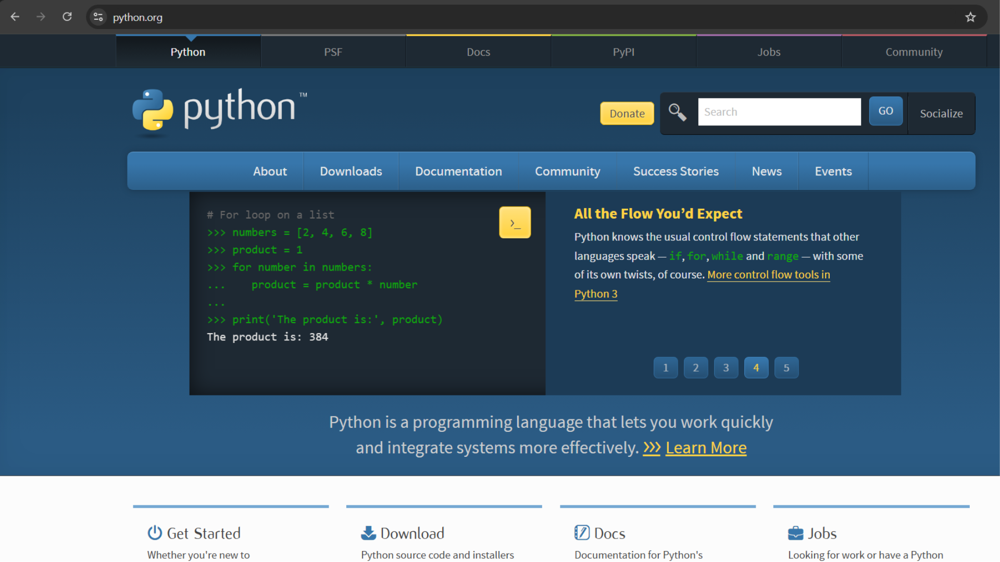
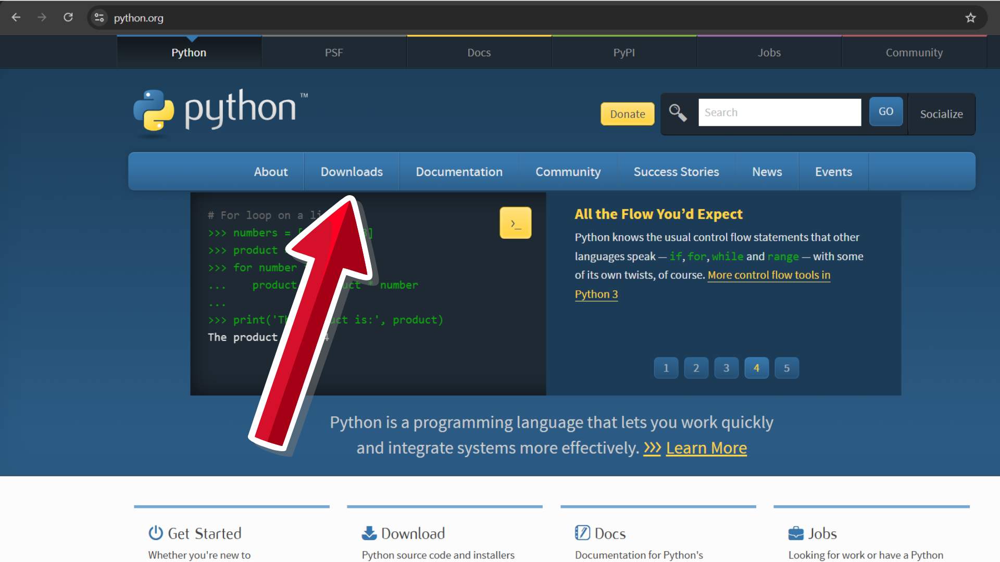
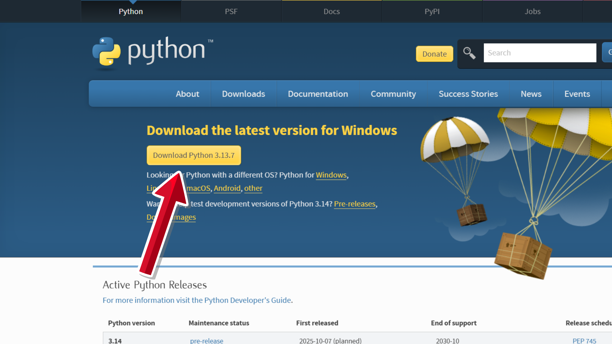
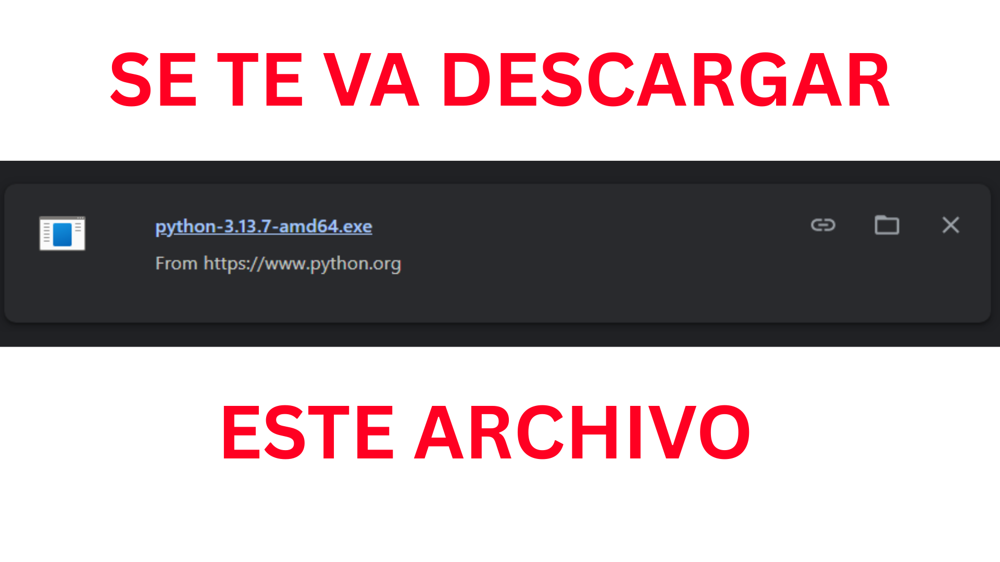

# Windows

Vamos a instalar Python. Si usas Windows a [Python](https://www.python.org/),

y te va a dar esta interfaz:

ahora le das a downloads:

en esta interfaz le das en download python:

Busca el archivo en la carpeta Descargas de tu PC y haz doble clic sobre él;
Se abrirá la ventana del instalador de Python; Antes de continuar, asegúrate de marcar la opción “Add Python to PATH”;
Luego haz clic en Instalar y sigue los pasos del asistente haciendo clic en Next hasta finalizar.
